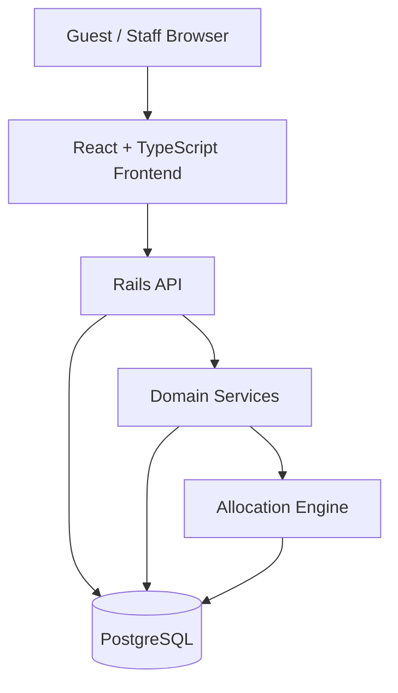

# Restaurant Waitlist

A full-stack application for a restaurant where walk-in guests join a queue from a shared QR-code entry point, watch their real-time status from their phone, and staff manage seating from a protected Staff screen.

**Guest capabilities:** anonymous Guest Join (no login, no account), idempotent Join under retries, Guest current status with a dynamic queue position, Guest Leave, and browser-refresh/session recovery.

**Allocation:** table-aware allocation across single tables and adjacent two-table combinations, scarcity- and aging-aware scoring, starvation protection, and atomic combined-table reservation — all backed by real PostgreSQL transactions and row locking, not application-level guesses.

**Staff capabilities:** Staff Login, Staff Queue, Staff Tables, Staff Seat (confirm a reservation by code), Staff Release, and Staff No-show.

**Correctness guardrails:** oversized/impossible-group rejection (a group size no table configuration could ever seat is rejected before it's created, not silently accepted and left permanently unseatable).

This implementation does **not** include live updates, caching, async notifications, or rate limiting — see [What We Cut](#what-we-cut).

## Quick Start

Requires Docker (developed and verified against Colima on Apple Silicon; Docker Desktop works equally well).

```bash
docker compose up --build
```

This starts three services:

| Service | URL | Notes |
|---|---|---|
| Frontend (React + TypeScript, Vite) | http://localhost:5173 | Guest and Staff screens |
| Backend (Rails API) | http://localhost:3000 | Health check at `/health` |
| PostgreSQL | localhost:5432 | Source of truth for all table/queue state |

No manual seed step is required — the backend seeds a deterministic 40-table restaurant (20×2-seat, 18×4-seat, 2×6-seat, 19 adjacency pairs) and one demo Staff user automatically as part of the normal Rails setup already baked into the Docker image.

**Demo Staff credentials** (obviously-fake, local-development-only — the same category as this project's own committed `postgres`/`postgres` database defaults, never a real credential):

```
Email:    staff@example.com
Password: demo-staff-password
```

## Architecture

PostgreSQL is the single source of truth for table and queue state — there is no cache in front of it, and no in-memory state that can drift from the database. Allocation decisions (which group gets which table) are made entirely by backend domain services; the frontend never computes a queue position, a table's status, or the outcome of a seat/release/no-show action — it only renders what the backend returns.



There is no separate cache, message queue, WebSocket server, or notification service in this implementation.

## Core Guest Flow

```text
Join
  ↓
WAITING / READY
  ↓
Dynamic position (WAITING) or seating code (READY)
  ↓
Guest can refresh the browser and recover the active visit
  ↓
Guest can Leave
```

Guest identity is not an account — there is no login, no password, and nothing is retained between separate visits. Each join produces an anonymous **active-visit token**, generated server-side and stored client-side (`localStorage`), which is the sole mechanism used to recover the current visit after a page reload. A terminal visit (left/seated/no-show) does not resume as an active session.

**Idempotency:** the Guest Join request carries a client-generated idempotency key. A retried request with the same key returns the existing entry rather than creating a duplicate — enforced by a database-level unique constraint, not just an application check, so it holds under real concurrent retries. The backend does not generate this key.

## Staff Flow

```text
Staff Login
    ↓
Queue / Tables
    ↓
READY guest
    ↓
Seat by seating code
    ↓
OCCUPIED
    ↓
Release
    ↓
FREE
```

```text
WAITING / READY guest
       ↓
    No-show
       ↓
    NO_SHOW
```

Staff "Seat" **confirms an already-made reservation** — the table decision itself was made earlier, when the group's configuration became available. Staff never manually choose a table.

## Allocation Algorithm

Seating is deliberately **not** first-in-first-out. Every currently-waiting group is evaluated together against every currently-available table configuration, and the best match is chosen deterministically each time a configuration becomes available:

- **Compatibility** — a configuration must have at least enough capacity for the group; this is a hard gate, never overridable by score.
- **Adjacent-table combinations** — a group too large for any single table may use two *adjacent* tables (from a fixed, seeded adjacency map) as one combined seating unit. A maximum of two tables may ever be combined.
- **Fit** — smaller, better-matching configurations are preferred over unnecessarily large ones.
- **Scarcity** — a group compatible with fewer available configurations is prioritized over one with many options.
- **Aging** — the longer a group has waited, the more its priority grows, up to a cap.
- **Starvation protection** — once a group has waited past a configured threshold, it is guaranteed priority over any non-protected competitor for its own compatible configuration (a categorical override, not just a bigger score).
- **Deterministic tie-breaking** — ties resolve by fewer tables consumed, then earlier arrival, then a stable identifier. No randomness.
- **Transactional reservation** — the winning table(s) are locked and reserved atomically in a single database transaction; a losing race retries against fresh state rather than reserving a stale table.

Example:

```text
Guest A: group size 6, arrived first
Guest B: group size 2, arrived later

If a compatible 2-seat table becomes available (and no
6+ configuration is available for A), B can be seated
before A — this is correct, not a bug: seating A would
require a configuration that doesn't exist yet, and
leaving a 2-seat table empty while it waits helps no one.
```

Optimizing purely for arrival order would leave usable tables empty while an earlier, larger group waits for a configuration that may not exist for a while — worse for every guest's actual wait time, not just Guest B's.

## Combined Tables and Atomicity

A large group may be seated across two adjacent tables, treated as one indivisible seating unit:

```text
reserve both tables → COMMIT

or

reserve neither → ROLLBACK
```

While combined, both tables belong to the same seating assignment and neither can be allocated independently. When released, both become available together, and the combination dissolves — the historical assignment row is preserved (never deleted), so past seatings remain queryable. This implementation never combines more than two tables.

## No-Starvation Rule

**Policy actually implemented:** once a waiting group has been waiting at least **20 minutes** (`STARVATION_THRESHOLD_SECONDS`, configurable via environment variable, default `1200` seconds), it becomes **starvation-protected**. From that point on, if any compatible configuration for that group's own complete required configuration becomes available, that group is guaranteed priority over every non-protected competitor for it — this is a categorical override applied *before* scoring, not merely a higher score that a sufficiently well-matched competitor could still outrank.

**What this guarantees:** priority once the group's complete compatible seating configuration actually becomes available.

**What this does *not* guarantee:** an absolute maximum total waiting time. If the group's required configuration (e.g., a specific size of table, or an adjacent pair) simply never frees up, the group can still wait longer than the threshold in absolute terms — starvation protection guarantees *precedence*, not a delivery deadline, because this system makes no prediction about when a table will next become free.

**Why this policy was chosen:** a hard maximum-wait promise would require either predicting future table availability (out of scope — this system only ever reasons about current state) or artificially holding a table for a starved group before its configuration genuinely exists, which would waste capacity that could seat someone else right now. Guaranteeing priority *once available* is the strongest honest guarantee that doesn't require either.

**What it costs:** while a starvation-protected group is waiting for its configuration, non-protected groups compatible with *other, already-available* configurations are unaffected and continue to be seated normally — starvation protection only ever excludes competitors for the *same* configuration the protected group needs. The cost is narrowly scoped, not a system-wide slowdown.

## Dynamic Queue Position

A waiting guest's `position` is not simple join order. It is computed by reusing the same allocation decision logic described above — run as a read-only, in-memory simulation (never a database write, never an actual reservation): the current waiting set and available configurations are evaluated to determine, in order, which groups would be seated first if allocation ran to completion from the current snapshot. This means position reflects current eligibility and availability (a group that could be seated right now generally outranks one that couldn't, regardless of who joined first) and starvation status (a protected group is prioritized exactly as it would be in real allocation). Position is purely informational and read-only — reading it never reserves a table, creates a reservation, or triggers allocation. The Guest UI never calculates a position locally; it only displays whatever the backend's read returns.

## Oversized Groups

- A group size at or below the largest configuration any table or adjacent pair could ever seat is accepted normally.
- A group size that **no** valid single table or adjacent combination could ever seat is rejected — before any queue entry is created — with a clear error directing the group to speak to staff directly.
- A group is **not** rejected merely because every suitable table happens to be occupied right now — that group is still valid and joins the queue normally, waiting like any other.

The maximum is never hardcoded — it is derived at request time from the actual configured tables and adjacency pairs.

## Persistence and Database Invariants

Core persisted models: `QueueEntry` (one group's waitlist record — status, group size, phone number, anonymous token, idempotency key, seating code), `SeatingAssignment` (a reservation/occupancy record for one `QueueEntry`, covering one or two tables), `SeatingAssignmentTable` (which table(s) a `SeatingAssignment` covers — the row carrying the actual exclusivity guarantee), `Table` (a physical table — id, capacity; no stored occupancy field), `TableAdjacency` (which tables may combine, seeded and static), and `StaffUser` (an authenticated staff actor).

- **One active group per table** — enforced at the database level by a partial unique index (a table can have at most one *non-released* claim at a time), not merely by application logic.
- **Active assignment claims are exclusive** — the constraint above is expressed entirely within the claiming table's own columns, so it can never depend on a value in another table staying in sync.
- **Released historical rows are retained**, never deleted — a table's occupancy is always derived at read time from whether a live claim exists, so past assignments remain queryable.
- **Combined assignments are atomic** — both member tables are reserved or released together, in one transaction, never independently.
- **Concurrent guest arrivals are protected** by real database transactions, explicit row locking (`SELECT ... FOR UPDATE`), and unique constraints — verified under genuine multi-threaded concurrency, not just sequential test calls.

No additional database tables or columns exist beyond the six models above.

## API Overview

All routes below are implemented as of this submission; verified directly against [`backend/config/routes.rb`](backend/config/routes.rb).

| Method | Route | Purpose | Auth |
|---|---|---|---|
| `POST` | `/guest/queue-entries` | Guest Join | none |
| `GET` | `/guest/queue-entries/current` | Guest current status (position or seating code) | `Bearer <active_visit_token>` |
| `POST` | `/guest/queue-entries/current/leave` | Guest Leave | `Bearer <active_visit_token>` |
| `POST` | `/staff/login` | Staff Login | none |
| `GET` | `/staff/queue` | Staff Queue (waiting + ready groups) | `Bearer <staff_session_token>` |
| `GET` | `/staff/tables` | Staff Tables (every table's live state) | `Bearer <staff_session_token>` |
| `POST` | `/staff/seat` | Staff Seat (confirm a reservation by code) | `Bearer <staff_session_token>` |
| `POST` | `/staff/seating-assignments/release` | Staff Release | `Bearer <staff_session_token>` |
| `POST` | `/staff/queue/no-show` | Staff No-show | `Bearer <staff_session_token>` |

Full request/response shapes and error conventions: [`documents/05-specifications/api-spec.md`](documents/05-specifications/api-spec.md).

## Testing and Verification

- **Backend test suite:** 348 tests, 790 assertions, 0 failures, 0 errors, 0 skipped (current as of this submission).
- **Frontend:** `npx tsc -b --noEmit` — 0 errors. `oxlint` — 0 warnings, 0 errors.
- **Real HTTP verification:** every endpoint above has been exercised against the actual running Rails backend (not mocked), including success, validation-error, conflict, and authentication-failure cases.
- **Real browser verification:** the complete Guest and Staff journeys — join, refresh/recovery, leave, login, queue, tables, seat, release, no-show — have been driven through the real frontend against the real backend with a real headless browser, not just unit-tested.
- **Real PostgreSQL verification:** table/adjacency counts, historical-row preservation, and side-effect-free reads have been inspected directly against the running database after each verification pass.
- **Concurrency/atomicity hard paths:** same-table and combined-table allocation races, combined-table atomic rollback, and idempotent-join races are all covered by dedicated real-thread concurrency tests, not just sequential simulations.
- **Idempotency, oversized-group rejection, dynamic position, and Guest/Staff refresh recovery** each have dedicated automated tests plus real end-to-end verification, described in detail in the AI working record below.

## AI-Native Development

This project was built using Claude Code deliberately and transparently, with every phase of work recorded rather than hidden. The full working record lives in [`documents/06-ai-working-record/`](documents/06-ai-working-record/), including the condensed text of every governing prompt actually used ([`agent-prompts.md`](documents/06-ai-working-record/agent-prompts.md)), a narrative session log ([`session-log.md`](documents/06-ai-working-record/session-log.md)), a table of non-obvious implementation decisions and their reasoning per session ([`agent-decisions.md`](documents/06-ai-working-record/agent-decisions.md)), and a record of genuine AI mistakes that were caught and corrected ([`ai-corrections.md`](documents/06-ai-working-record/ai-corrections.md)) — see below.

**Workflow:**

```text
requirements
    ↓
explicit product/spec decisions (documents/02-product-decisions/)
    ↓
constrained, scoped Claude prompts (one bounded objective each)
    ↓
implementation
    ↓
automated tests (including hard-path/concurrency tests)
    ↓
real API / browser / database verification
    ↓
correction when the agent was wrong
```

Project-specific guidance for the AI is defined in [`CLAUDE.md`](CLAUDE.md), plus custom Claude Code agents (`backend-domain-agent`, `spec-reviewer`, `test-engineering-agent`, `code-review-agent`), skills (`hard-path-testing`, `rails-domain-development`, `requirement-traceability`), and commands (`/spec-review`, `/test-hard-paths`, `/requirements-check`) under [`.claude/`](.claude/). No MCP servers and no automation hooks beyond a handful of destructive-command permission guards were used in this project — stated plainly rather than implied.

### AI Corrections (representative examples)

The full, unabridged record of every correction is in [`documents/06-ai-working-record/ai-corrections.md`](documents/06-ai-working-record/ai-corrections.md); three representative cases:

**Starvation-policy interpretation.** The agent assumed → an early draft of the starvation policy claimed it "provably satisfies no group waits forever," an unbounded-wait guarantee. → Detected → self-contradicted by the same document's own "what it costs" section two paragraphs later, and flagged in human review. → Changed → the guarantee was rewritten to the precise, weaker claim actually implemented: priority once the group's complete configuration is available, never an absolute maximum wait time. → Verified → the corrected wording was applied consistently across every document that referenced it, with no stronger version left standing anywhere.

**Release semantics.** The agent assumed → the staff release API could accept a raw `table_id` or `combination_id` directly from the caller. → Detected → human review pointed out this allowed, in principle, releasing only half of a combined pair — inconsistent with the atomicity the rest of the system enforces. → Changed → release now accepts only the queue entry's own id; the server resolves and releases the complete assignment internally, never a caller-supplied table identifier. → Verified → this is now the only way release works anywhere in the codebase, covered by dedicated combined-release tests.

**Lazy expiration.** The agent assumed → an early version of staff seat confirmation checked only the entry's and assignment's stored status, without checking whether the reservation had actually expired. → Detected → self-caught while re-reading the specification line-by-line against the implementation, not by a failing test — the existing tests only ever exercised non-expired reservations. → Changed → confirmation now checks for an overdue reservation first and expires it (releasing the table) instead of confirming a stale hold. → Verified → new tests specifically construct an overdue-but-otherwise-valid-looking reservation and confirm it is correctly expired, not seated.

## What We Cut

The final implementation intentionally does **not** include:

- live updates (guests/staff must refresh or re-fetch; no polling/streaming channel)
- caching or cache invalidation
- asynchronous table-ready notifications
- Redis
- Sidekiq / any background job queue
- WebSockets
- production observability/metrics
- rate limiting
- advanced staff management (roles, permissions, multi-user administration)
- OAuth / SSO / MFA
- password reset
- predictive or AI-driven allocation

These are not bugs — they were deliberately out of scope so effort could go into a thin but *correct* P0 slice: allocation correctness, concurrency, atomicity, idempotency, starvation handling, real persisted state (not fabricated responses), the full set of staff operational flows, and hard-path testing for all of the above. A thin, verifiably correct slice was prioritized over a broader, half-working application.

## What We Would Add With More Time

**P1**
- Live updates via polling or WebSockets, so guests and staff see changes without refreshing
- Caching of high-frequency guest status reads, with correct invalidation
- Asynchronous table-ready notifications (e.g., SMS)
- Structured logging and production metrics
- Rate limiting
- Richer staff operations (bulk actions, manual position overrides)

**Later**
- Staff-facing manual overrides for edge cases
- A restaurant table/adjacency configuration UI (currently seeded, not editable)
- Multi-location support
- Stronger, non-stub staff authentication
- Operational dashboards

## Documentation

- Requirements: [`documents/01-requirements/`](documents/01-requirements/)
- Product decisions (seating algorithm, starvation policy, scope): [`documents/02-product-decisions/`](documents/02-product-decisions/)
- System/domain/data/API architecture: [`documents/03-architecture/`](documents/03-architecture/)
- Key-flow diagrams: [`documents/04-diagrams/`](documents/04-diagrams/)
- Implementation-ready specifications: [`documents/05-specifications/`](documents/05-specifications/)
  - Functional specification: [`documents/05-specifications/functional-spec.md`](documents/05-specifications/functional-spec.md)
  - Allocation specification: [`documents/05-specifications/allocation-spec.md`](documents/05-specifications/allocation-spec.md)
  - API specification: [`documents/05-specifications/api-spec.md`](documents/05-specifications/api-spec.md)
- AI working record (prompts, decisions, corrections, session log): [`documents/06-ai-working-record/`](documents/06-ai-working-record/)
- Explicitly deferred future scope: [`documents/07-future-evolution/`](documents/07-future-evolution/)
