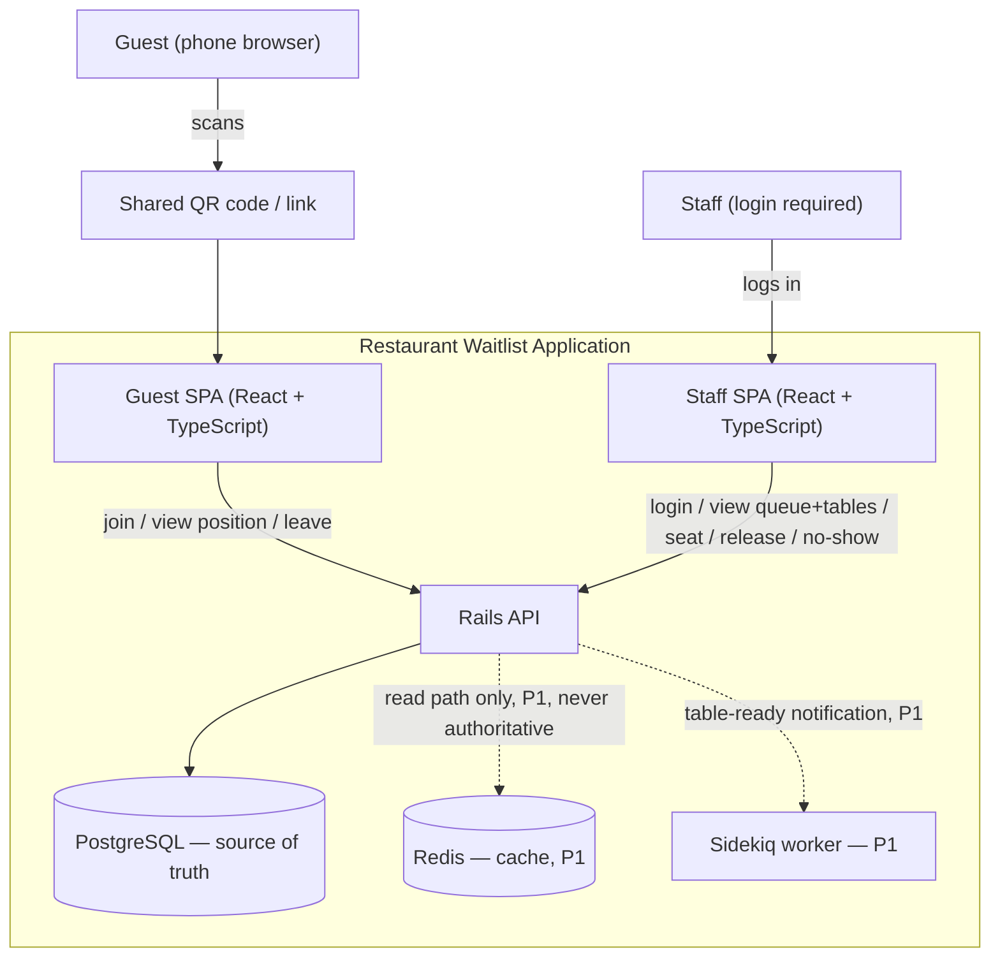

# Diagram — System Context

Notes:
- One shared QR code for all guests (no per-guest identity in the link itself) — REQ-GUEST-001.
- Staff SPA is behind stub auth; Guest SPA is public — NFR-SEC-001/002.
- Redis and Sidekiq are P1; the system is fully functional without them for P0. PostgreSQL is always the sole source of truth for table allocation (DEC-013).
