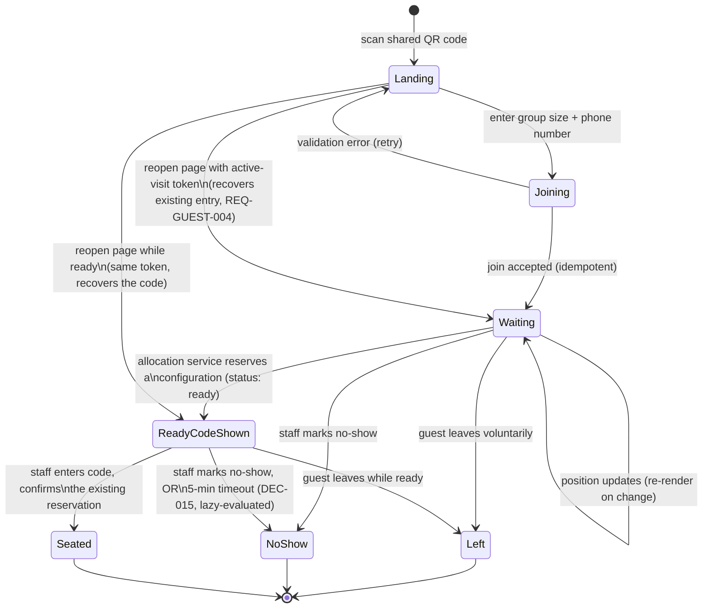

# Diagram — Guest Journey

Notes:
- "Reopen page" only resumes a *non-terminal* (`Waiting`/`ReadyCodeShown`) entry — a terminal entry (`Left`/`NoShow`/`Seated`) does not behave as an active session again (DEC-006).
- `ReadyCodeShown` **is** a persisted `QueueEntry` status (`ready`) — revised from an earlier version of this diagram, which described it as UI-only. The allocation decision (which table(s), the `seating_code`) is made and reserved the moment the entry enters this state, *before* staff act — see `03-architecture/domain-model.md` for the authoritative state machine and `05-specifications/domain-model-proposal.md` §0 for why.
- The `ReadyCodeShown → NoShow` edge has two triggers that land on the identical outcome: staff manually marking no-show, or DEC-015's 5-minute lazy-evaluated expiration firing on the next operation that touches this entry. The guest-facing result is the same either way — no distinct "expired" state is shown.
