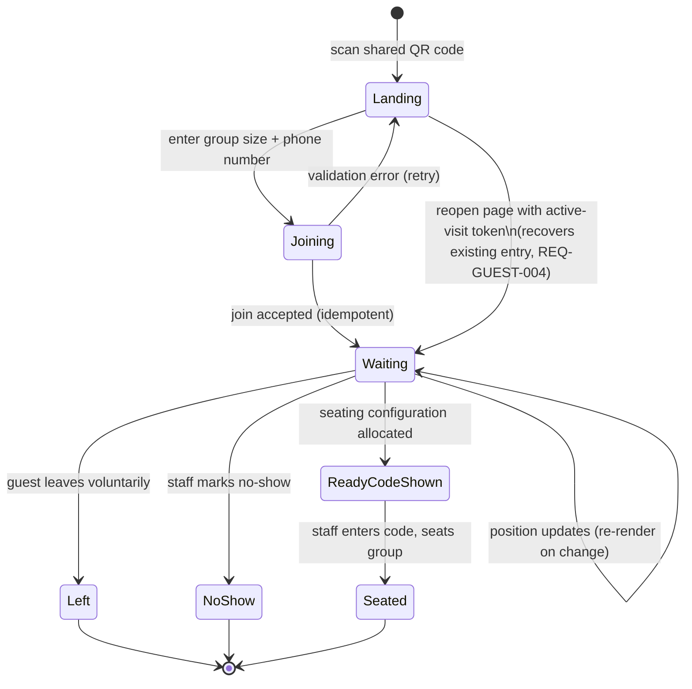

# Diagram — Guest Journey

Notes:
- "Reopen page" only resumes a *non-terminal* (`Waiting`/`ReadyCodeShown`) entry — a terminal entry (`Left`/`NoShow`/`Seated`) does not behave as an active session again (DEC-006).
- `ReadyCodeShown` corresponds to the guest seeing their seating code (REQ-GUEST-005); it is not itself a persisted `QueueEntry` status beyond `waiting` — see `03-architecture/domain-model.md` for the authoritative state machine.
