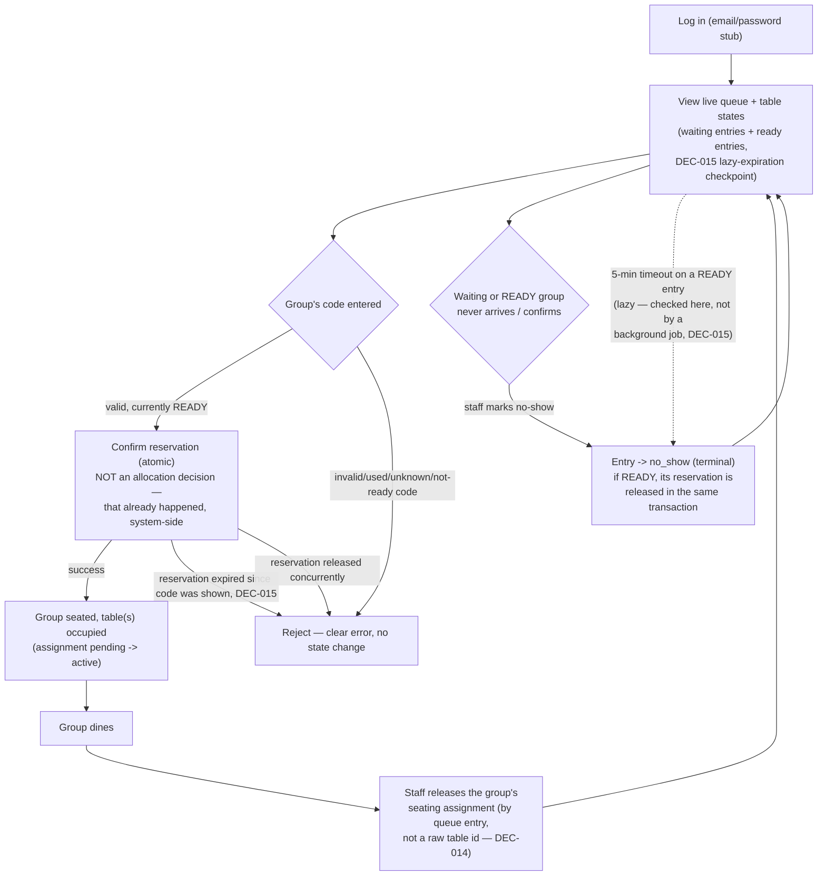

# Diagram — Staff Journey

Notes:
- Staff never run the allocation algorithm. The system (allocation service, triggered by join/release/no-show/leave events) already chose a group's table configuration *before* that group ever shows a code — "Confirm" only validates and activates an existing `pending` `SeatingAssignment`. See `05-specifications/allocation-spec.md` §5 vs. §5a for the split.
- Release sets `released_at` on the assignment's `SeatingAssignmentTable` row(s) (never deletes them — history retained) — both together if combined, so both member tables become independently available at once (INV-006, CORR-004).
- The dashed edge into `NoShow` represents DEC-015: any dashboard view (or other operation touching a `ready` entry) that notices a reservation held past 5 minutes converts it to `no_show` and releases its table(s) inline, as a side effect of that read — not via a scheduler.
