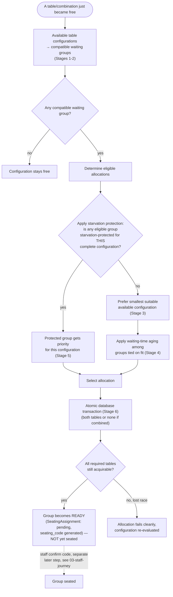

# Diagram — Seating Allocation Policy

Compatibility-Aware Aging with Maximum-Wait Protection (`02-product-decisions/seating-allocation-policy.md`). Renamed in Session 2 human review — see `06-ai-working-record/ai-corrections.md` CORR-002.

This is a global reasoning process over all currently compatible configurations and waiting groups — explicitly **not** naive per-table greedy iteration (`for each table: find first group that fits; seat it`), which cannot correctly express smallest-fit preference or starvation protection.

Critical rule reminder (`seating-allocation-policy.md` Stage 5): starvation protection only ever applies once the group's **complete** required configuration is simultaneously available — a lone free table that is only half of a protected group's need does not trigger `AnyProtected = yes`.

**Precise guarantee (corrected wording):** maximum-wait protection guarantees priority when the group's complete compatible seating configuration becomes available. It does not guarantee an absolute maximum total waiting time (`starvation-policy.md`).

**This entire flow ends at READY, not SEATED.** Everything above is the allocation service's decision — it runs on system events (join/release/no-show/leave), never on a staff action. Staff confirmation (`ready → seated`) is a separate, later flow — see `03-staff-journey.md` — that only validates and activates the reservation this flow already made; it never re-runs any step above.
