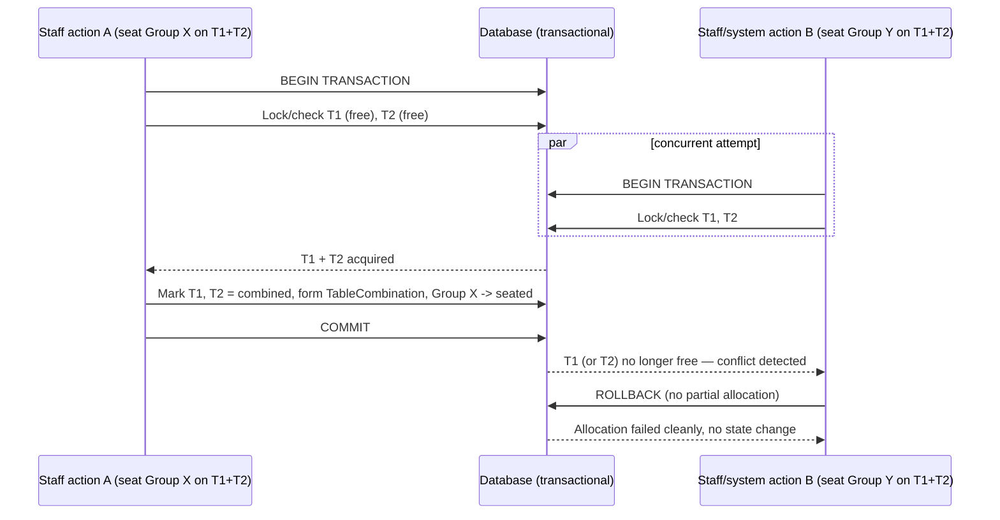

# Diagram — Combined-Table Atomic Allocation

Illustrates INV-005 (all-or-nothing) under a concurrent race for the same adjacent pair.

Notes:
- Whichever transaction commits first wins the full pair; the loser's transaction rolls back entirely — there is no state where one of T1/T2 ends up combined while the other doesn't (INV-005, INV-008).
- The losing action's group remains `waiting` and is re-evaluated on the next allocation pass (`04-seating-allocation.md`), not left in an inconsistent or partially-seated state.
- Exact locking mechanism (pessimistic row lock vs. optimistic version check + retry) is an implementation-phase decision; either satisfies this atomicity contract.
