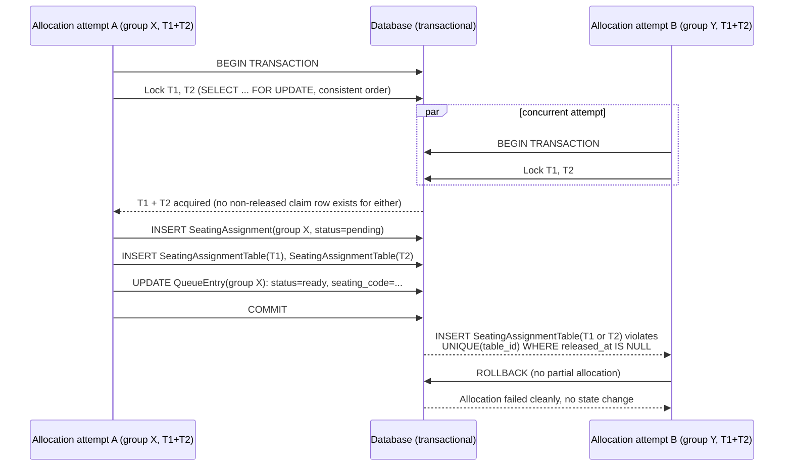

# Diagram — Combined-Table Atomic Allocation

Illustrates INV-005 (all-or-nothing) under a concurrent race for the same adjacent pair. **Both participants here are the allocation service** (system-triggered, e.g. two release/no-show events each independently re-triggering allocation) — not staff. Staff never perform this step; see `03-staff-journey.md` for the separate confirmation flow.

Notes:
- Whichever transaction commits first wins the full pair; the loser's transaction rolls back entirely — there is no state where one of T1/T2 has a claim row while the other doesn't (INV-005, INV-008).
- The result of the winning transaction is `ready`, **not** `seated` — group X still needs staff to confirm via the seating code (`allocation-spec.md` §5a) before actually being seated. This diagram illustrates the allocation race only.
- The losing attempt's group remains `waiting` and is re-evaluated on the next allocation pass (`04-seating-allocation.md`), not left in an inconsistent or partially-reserved state.
- The database-level backstop here is the `UNIQUE(table_id) WHERE released_at IS NULL` constraint on `SeatingAssignmentTable` (finalized design — see `06-ai-working-record/ai-corrections.md` CORR-004 for why an earlier, denormalized-status version of this constraint would not actually have worked in PostgreSQL). Row locking is the primary mechanism; this constraint is what makes the guarantee hold even if locking discipline is ever imperfect.
