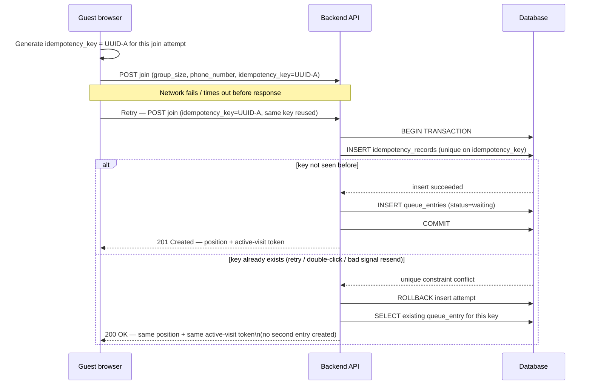

# Diagram — Guest Join Idempotency

Notes:
- The unique constraint on `idempotency_key` (`03-architecture/data-model.md`) is the enforcement point — this is a database guarantee, not a frontend-only debounce (guards against the AI-agent risk of "idempotency implemented only in the frontend," Phase 1 analysis §20).
- Phone number is never the idempotency key (DEC-007) — two different guests could share a phone number, and one guest could legitimately submit two genuinely different requests.
- A double-click that fires two near-simultaneous requests with the *same* key resolves the same way: one wins the insert, the other observes the conflict and returns the existing entry.
- A genuinely new join attempt (a different visit, not a retry) generates a new key (e.g., UUID-B) — the idempotency key identifies *this specific join attempt*, not the guest or their phone number.
